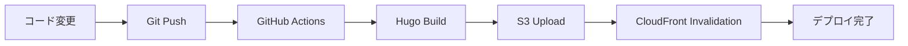

# 🚀 CI/CD パイプライン

このディレクトリには、AWS + Hugo テックブログの自動デプロイ用の GitHub Actions ワークフローが含まれています。

## 📋 概要

### デプロイフロー



### 対象ブランチ

- **main**: 本番環境デプロイ
- **develop**: ステージング環境デプロイ
- **Pull Request**: ビルドテストのみ

## 🔧 ワークフロー詳細

### deploy.yml

メインのデプロイワークフローです。

#### トリガー条件

- `main`、`develop`ブランチへのプッシュ
- `main`ブランチへのプルリクエスト

#### 実行ステップ

1. **Checkout**: ソースコードの取得
2. **Setup Hugo**: Hugo v0.149.0 のセットアップ
3. **Build**: Hugo サイトのビルド（minify 有効）
4. **AWS 認証**: GitHub Secrets を使用した AWS 認証
5. **S3 デプロイ**: 静的ファイルの S3 アップロード
6. **CloudFront 無効化**: キャッシュの無効化
7. **通知**: デプロイ結果の通知

## 🔐 必要な設定

### GitHub Secrets

以下の Secrets を設定する必要があります：

| Secret 名               | 説明                                   |
| ----------------------- | -------------------------------------- |
| `AWS_ACCESS_KEY_ID`     | IAM ユーザーのアクセスキー ID          |
| `AWS_SECRET_ACCESS_KEY` | IAM ユーザーのシークレットアクセスキー |

詳細な設定手順は [SETUP_SECRETS.md](./SETUP_SECRETS.md) を参照してください。

### IAM 権限

IAM ユーザーには以下の権限が必要です：

- **S3**: `s3:PutObject`, `s3:DeleteObject`, `s3:ListBucket`
- **CloudFront**: `cloudfront:CreateInvalidation`

## 📊 デプロイ先リソース

### 現在の環境

- **S3 バケット**: `techblog-staging-staging-bucket-ud83sqdw`
- **CloudFront**: `E3IY2D06Y9FT5D`
- **URL**: `https://d3bflftl7cln1y.cloudfront.net`
- **リージョン**: `ap-northeast-1`

## 🔍 監視・ログ

### GitHub Actions

- **ワークフロー実行履歴**: Actions タブで確認
- **ログ**: 各ステップの詳細ログを確認可能
- **通知**: デプロイ成功・失敗の通知

### AWS CloudWatch

- **S3 アクセスログ**: CloudWatch で監視
- **CloudFront メトリクス**: リクエスト数、エラー率など
- **ロググループ**: `/aws/cloudfront/techblog-staging-staging`

## 🚨 トラブルシューティング

### よくある問題

1. **AWS 認証エラー**

   - GitHub Secrets の設定を確認
   - IAM 権限を確認

2. **S3 アップロードエラー**

   - バケット名の確認
   - S3 権限の確認

3. **CloudFront 無効化エラー**

   - ディストリビューション ID の確認
   - CloudFront 権限の確認

4. **Hugo ビルドエラー**
   - `hugo.toml`の設定確認
   - テーマファイルの確認

### デバッグ方法

1. **ローカルテスト**:

   ```bash
   cd hugo-site
   hugo --minify
   ```

2. **AWS CLI テスト**:

   ```bash
   aws s3 ls s3://techblog-staging-staging-bucket-ud83sqdw
   aws cloudfront get-distribution --id E3IY2D06Y9FT5D
   ```

## 📈 パフォーマンス最適化

### ビルド時間短縮

- **キャッシュ**: Hugo のキャッシュ機能を活用
- **並列処理**: 可能な限り並列実行
- **最小化**: CSS/JS の最小化

### デプロイ時間短縮

- **差分アップロード**: `--delete`オプションで差分のみ
- **圧縮**: gzip 圧縮の活用
- **キャッシュ制御**: 適切な Cache-Control ヘッダー

## 🔄 今後の改善予定

- [ ] テスト自動化の追加
- [ ] セキュリティスキャンの統合
- [ ] パフォーマンステストの自動化
- [ ] 複数環境対応（staging/production）
- [ ] Slack 通知の追加
