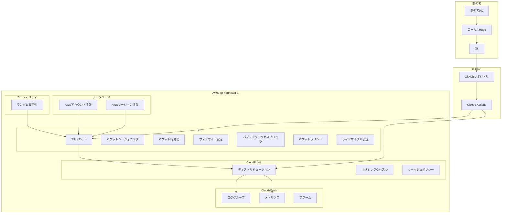

# AWS + Hugo テックブログ インフラ設計書

## 概要

本ドキュメントは、AWS と Hugo を組み合わせた静的テックブログのインフラ設計を定義します。staging 環境として、ローカル開発・テスト用途に特化した AWS リソースの構成を詳細に記述しています。

## インフラ設計方針

### 基本方針

- **最小構成**: 必要最小限の AWS リソースで構成
- **コスト最適化**: 無料枠を最大限活用
- **セキュリティ**: 最小権限の原則に従った設計
- **運用性**: 監視・ログ・バックアップの適切な設定

### 制約事項

- **リージョン**: ap-northeast-1（東京）
- **可用性**: シングル AZ 構成（staging 環境のため）
- **ドメイン**: カスタムドメインは使用しない
- **SSL**: ACM 証明書は使用しない

## インフラ構成図

### 全体構成



### ネットワーク構成

```text
インターネット
    ↓
CloudFront (エッジロケーション)
    ↓
S3バケット (ap-northeast-1)
    ↓
IAM認証・認可
```

## AWS リソース詳細設計

### 1. データソース（読み取り専用）

#### AWS アカウント情報

- **リソースタイプ**: `data.aws_caller_identity.current`
- **用途**: 現在の AWS アカウント ID の取得
- **出力**: アカウント ID、ARN、ユーザー ID

#### AWS リージョン情報

- **リソースタイプ**: `data.aws_region.current`
- **用途**: 現在の AWS リージョンの取得
- **出力**: リージョン名、リージョン説明

### 2. ユーティリティリソース

#### ランダム文字列

- **リソースタイプ**: `random_string.bucket_suffix`
- **用途**: S3 バケット名の一意性確保
- **設定**: 8 文字、特殊文字なし、小文字のみ

### 3. IAM（Identity and Access Management）

#### IAM ユーザー設計

**※ 既存の IAM ユーザーを使用（手動で作成済み）**:

| ユーザー名         | 用途     | 権限               | アクセスキー |
| ------------------ | -------- | ------------------ | ------------ |
| `techblog-staging` | CI/CD 用 | S3/CloudFront 操作 | 有効         |

#### IAM ポリシー設計

**S3 アクセスポリシー**:

```json
{
  "Version": "2012-10-17",
  "Statement": [
    {
      "Effect": "Allow",
      "Action": [
        "s3:GetObject",
        "s3:PutObject",
        "s3:DeleteObject",
        "s3:ListBucket"
      ],
      "Resource": [
        "arn:aws:s3:::techblog-staging-staging-bucket-ud83sqdw",
        "arn:aws:s3:::techblog-staging-staging-bucket-ud83sqdw/*"
      ]
    }
  ]
}
```

**CloudFront 操作ポリシー**:

```json
{
  "Version": "2012-10-17",
  "Statement": [
    {
      "Effect": "Allow",
      "Action": [
        "cloudfront:CreateInvalidation",
        "cloudfront:GetInvalidation",
        "cloudfront:ListInvalidations"
      ],
      "Resource": "*"
    }
  ]
}
```

### 4. S3（Simple Storage Service）

#### バケット設計

| 項目               | 設定値                                     | 備考                   |
| ------------------ | ------------------------------------------ | ---------------------- |
| バケット名         | `techblog-staging-staging-bucket-{random}` | グローバル一意         |
| リージョン         | ap-northeast-1                             | 東京リージョン         |
| バージョニング     | 有効                                       | データ保護             |
| 暗号化             | AES256                                     | デフォルト暗号化       |
| パブリックアクセス | ブロック                                   | セキュリティ           |
| ウェブサイト設定   | 有効（index.html, 404.html）               | 静的サイトホスティング |

#### バケット設定詳細

**バージョニング設定**:

- **ステータス**: Enabled
- **用途**: データ保護と復旧

**暗号化設定**:

- **アルゴリズム**: AES256
- **適用範囲**: 全オブジェクト

**ウェブサイト設定**:

- **インデックスドキュメント**: index.html
- **エラードキュメント**: 404.html

**パブリックアクセスブロック**:

- **ブロックパブリック ACL**: 有効
- **ブロックパブリックポリシー**: 有効
- **無視パブリック ACL**: 有効
- **制限パブリックバケット**: 有効

#### バケットポリシー（一時的に無効化）

```json
{
  "Version": "2012-10-17",
  "Statement": [
    {
      "Sid": "AllowCloudFrontAccess",
      "Effect": "Allow",
      "Principal": {
        "AWS": "arn:aws:cloudfront::276713244139:distribution/E3IY2D06Y9FT5D"
      },
      "Action": "s3:GetObject",
      "Resource": "arn:aws:s3:::techblog-staging-staging-bucket-ud83sqdw/*"
    }
  ]
}
```

#### ライフサイクル設定

```json
{
  "Rules": [
    {
      "ID": "cleanup-old-versions",
      "Status": "Enabled",
      "Filter": {
        "Prefix": ""
      },
      "NoncurrentVersionTransition": {
        "NoncurrentDays": 30,
        "StorageClass": "STANDARD_IA"
      },
      "NoncurrentVersionExpiration": {
        "NoncurrentDays": 60
      }
    }
  ]
}
```

### 5. CloudFront

#### ディストリビューション設計

| 項目                      | 設定値                        | 備考                   |
| ------------------------- | ----------------------------- | ---------------------- |
| ディストリビューション ID | E3IY2D06Y9FT5D                | 実際の ID              |
| ドメイン名                | d3bflftl7cln1y.cloudfront.net | 実際のドメイン         |
| オリジン                  | S3 バケット                   | 静的サイトホスティング |
| ビヘイビア                | デフォルト                    | キャッシュ設定         |
| エラー処理                | カスタムエラーページ          | ユーザビリティ向上     |
| ログ                      | CloudWatch                    | アクセスログ           |

#### オリジン設定

**S3 オリジン**:

- **ドメイン名**: techblog-staging-staging-bucket-ud83sqdw.s3.amazonaws.com
- **オリジン ID**: S3-techblog-staging-staging-bucket-ud83sqdw
- **オリジンアクセスアイデンティティ**: E25WKYHIDWKBQP

#### キャッシュ設定

**デフォルトビヘイビア**:

- **TTL**: 86400 秒（24 時間）
- **最小 TTL**: 0 秒
- **最大 TTL**: 31536000 秒（1 年）
- **圧縮**: 有効
- **HTTPS 強制**: redirect-to-https
- **許可メソッド**: GET, HEAD, OPTIONS
- **キャッシュメソッド**: GET, HEAD

**カスタムキャッシュポリシー**:

- **ポリシー名**: Custom-CachingOptimized
- **クッキー**: キャッシュ対象外
- **ヘッダー**: キャッシュ対象外
- **クエリ文字列**: キャッシュ対象外

#### エラー処理

| HTTP ステータス | カスタムエラーページ | 備考     |
| --------------- | -------------------- | -------- |
| 403             | `/index.html`        | SPA 対応 |
| 404             | `/index.html`        | SPA 対応 |

#### 証明書設定

- **証明書**: CloudFront デフォルト証明書
- **最小プロトコル**: TLSv1
- **HTTP/2**: 有効
- **IPv6**: 有効

### 6. CloudWatch

#### ロググループ設計

| ロググループ名                             | 保持期間 | 用途         |
| ------------------------------------------ | -------- | ------------ |
| `/aws/cloudfront/techblog-staging-staging` | 30 日    | アクセスログ |
| `/aws/s3/techblog-staging-staging`         | 30 日    | S3 操作ログ  |

#### メトリクス監視

**CloudFront メトリクス**:

- **Requests**: リクエスト数
- **BytesDownloaded**: ダウンロード量
- **TotalErrorRate**: エラー率
- **ResponseTime**: レスポンス時間

**S3 メトリクス**:

- **NumberOfObjects**: オブジェクト数
- **BucketSizeBytes**: バケットサイズ
- **AllRequests**: リクエスト数

#### アラーム設定

| アラーム名         | メトリクス     | 閾値 | アクション |
| ------------------ | -------------- | ---- | ---------- |
| `HighErrorRate`    | TotalErrorRate | 5%   | SNS 通知   |
| `HighResponseTime` | ResponseTime   | 2 秒 | SNS 通知   |
| `LowRequestCount`  | Requests       | 1    | SNS 通知   |

**ディストリビューション ID**: E3IY2D06Y9FT5D

## セキュリティ設計

### ネットワークセキュリティ

#### S3 セキュリティ

- **パブリックアクセスブロック**: 全項目を有効化
- **バケットポリシー**: CloudFront からのみアクセス許可
- **暗号化**: デフォルトで SSE-S3 暗号化
- **バージョニング**: データ保護と復旧

#### CloudFront セキュリティ

- **オリジンアクセス制御**: S3 への直接アクセスを防止
- **HTTPS 強制**: セキュアな通信
- **ヘッダー制限**: 必要最小限のヘッダーのみ許可

### アクセス制御

#### IAM セキュリティ

- **最小権限の原則**: 必要最小限の権限のみ付与
- **アクセスキーローテーション**: 90 日ごとの更新
- **条件付きアクセス**: IP アドレス制限（必要に応じて）

#### リソースタグ

```hcl
default_tags {
  tags = {
    Project     = "techblog-staging"
    Environment = "staging"
    ManagedBy   = "Terraform"
    Purpose     = "Static Blog Hosting"
    Owner       = "Developer"
    Stage       = "Development"
  }
}
```

## パフォーマンス設計

### キャッシュ最適化

#### CloudFront キャッシュ戦略

- **静的ファイル**: 長時間キャッシュ（24 時間）
- **HTML ファイル**: 短時間キャッシュ（5 分）
- **キャッシュ無効化**: デプロイ時に自動実行
- **圧縮**: gzip 圧縮による転送量削減

#### S3 最適化

- **ライフサイクル管理**: 古いバージョンの自動削除
- **ストレージクラス**: Standard-IA（長期保存時）
- **並列アップロード**: 大容量ファイルの分割アップロード

### スケーラビリティ

#### 自動スケーリング

- **CloudFront**: エッジロケーションによる自動スケーリング
- **S3**: 容量制限なし、自動的なスケーリング
- **IAM**: ユーザー・ポリシーの動的追加

#### パフォーマンス監視

- **CloudWatch**: リアルタイムメトリクス
- **アラーム**: パフォーマンス低下の早期発見
- **ログ分析**: アクセスパターンの分析

## 障害対策設計

### 可用性設計

#### 冗長化

- **S3**: 99.99%の可用性（AWS 標準）
- **CloudFront**: 99.9%の可用性
- **IAM**: 99.9%の可用性

#### フェイルオーバー

- **ローカル環境**: Hugo サーバーによる代替確認
- **S3 障害時**: ローカルファイルでの動作確認
- **CloudFront 障害時**: S3 直接アクセスでの確認

### 復旧設計

#### データ復旧

- **S3**: バージョニングによる復旧
- **Terraform**: 状態ファイルからの復旧
- **Git**: リポジトリからの復旧

#### 障害対応手順

1. **状況確認**: CloudWatch メトリクス・ログの確認
2. **影響範囲**: 障害の影響範囲の特定
3. **復旧作業**: 段階的な復旧作業の実行
4. **動作確認**: 復旧後の動作確認
5. **事後対応**: 再発防止策の検討・実施

## コスト設計

### コスト構成

| サービス   | 月額コスト | 無料枠         | 備考               |
| ---------- | ---------- | -------------- | ------------------ |
| S3         | $0.00      | 5GB            | ストレージ         |
| CloudFront | $0.00      | 1TB            | 転送量             |
| IAM        | $0.00      | 無制限         | ユーザー・ポリシー |
| CloudWatch | $0.00      | 基本メトリクス | ログ・アラーム     |

### コスト最適化

#### 無料枠の活用

- **S3**: 5GB まで無料
- **CloudFront**: 1TB まで無料
- **CloudWatch**: 基本メトリクス無料

#### 使用量監視

- **コストアラート**: 予算超過防止
- **使用量分析**: 月次レポート
- **最適化提案**: コスト削減の検討

## 運用設計

### 監視・ログ

#### 日常監視

- **CloudWatch ダッシュボード**: 主要メトリクスの可視化
- **アラーム**: 異常値の早期発見
- **ログ分析**: アクセスログの定期確認

#### 定期メンテナンス

- **セキュリティパッチ**: 月次更新
- **アクセスキーローテーション**: 90 日ごと
- **コスト分析**: 月次レビュー

### バックアップ・復旧

#### バックアップ戦略

- **S3**: バージョニングによる自動バックアップ
- **Terraform**: 状態ファイルのバックアップ
- **Git**: リポジトリのバックアップ

#### 復旧手順

1. **Terraform 状態の復旧**: 状態ファイルからの復旧
2. **S3 データの復旧**: バージョニングからの復旧
3. **設定の復旧**: Terraform による再構築

## インフラ設計チェックリスト

### 基本設計

- [x] リソース構成が適切に設計されている
- [x] セキュリティ要件が満たされている
- [x] パフォーマンス要件が満たされている
- [x] コストが最適化されている

### AWS リソース

- [x] データソースが適切に設定されている
- [x] ユーティリティリソースが適切に設計されている
- [x] S3 バケットの設定が適切である
- [x] CloudFront の設定が最適化されている
- [x] CloudWatch の監視が設定されている

### セキュリティ

- [x] 最小権限の原則が適用されている
- [x] 暗号化が適切に設定されている
- [x] アクセス制御が適切である
- [x] ログ・監視が設定されている

### 運用性

- [x] 障害対策が計画されている
- [x] バックアップ・復旧が計画されている
- [x] 監視・アラートが設定されている
- [x] コスト管理が計画されている

### 現在の環境固有の項目

- [x] S3 バケット名が自動生成されている（techblog-staging-staging-bucket-ud83sqdw）
- [x] CloudFront ディストリビューションが作成されている（E3IY2D06Y9FT5D）
- [x] CloudFront ドメインが利用可能である（d3bflftl7cln1y.cloudfront.net）
- [x] S3 バケットポリシーが一時的に無効化されている（循環依存回避）
- [x] CloudWatch ロググループが作成されている（/aws/cloudfront/techblog-staging-staging）

## 変更履歴

| 日付       | バージョン | 変更内容 | 変更者 |
| ---------- | ---------- | -------- | ------ |
| 202x-xx-XX | 1.0.0      | 初版作成 | -      |

---

## 注意事項

- 本設計書は staging 環境用の設計です
- 本番環境では追加のセキュリティ・可用性要件が必要です
- 設計変更時は必ずレビューを実施してください
- 定期的な設計の見直しを行ってください
- AWS の料金体系や制限事項は定期的に確認してください

### 現在の環境固有の注意事項

- **S3 バケット名**: `techblog-staging-staging-bucket-ud83sqdw`（自動生成）
- **CloudFront ディストリビューション ID**: `E3IY2D06Y9FT5D`
- **CloudFront ドメイン**: `d3bflftl7cln1y.cloudfront.net`
- **CloudWatch ロググループ**: `/aws/cloudfront/techblog-staging-staging`
- **S3 バケットポリシー**: 一時的に無効化（循環依存回避のため）
- **オリジンアクセスアイデンティティ**: `E25WKYHIDWKBQP`
- **カスタムキャッシュポリシー**: `Custom-CachingOptimized`
