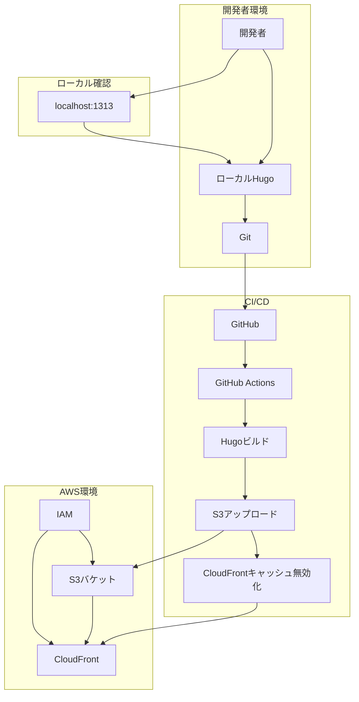
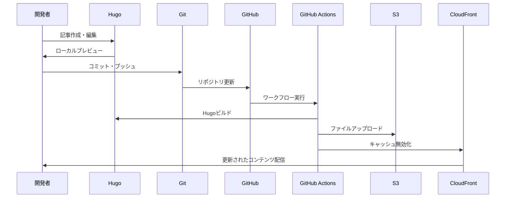

# 🏗️ AWS + Hugo テックブログ システム設計書

## 📋 概要

本ドキュメントは、AWS と Hugo を組み合わせた静的テックブログのシステム設計を定義します。staging 環境として、ローカル開発・テスト用途に特化した設計となっています。

## 🎯 設計方針

### 基本方針

- **シンプル性**: 必要最小限の AWS リソースで構成
- **ローカル優先**: 開発・テストはローカル環境で完結
- **コスト最適化**: AWS 無料枠を最大限活用
- **自動化**: CI/CD によるデプロイ自動化

### 制約事項

- **ドメイン管理**: staging 環境ではドメイン設定を行わない
- **SSL 証明書**: ACM 証明書は使用しない
- **マルチ AZ**: シングル AZ 構成（staging 環境のため）
- **外部アクセス**: ローカル開発者からのみアクセス

## 🏗️ システムアーキテクチャ

### 全体構成図



### システム構成要素

| 要素           | 技術              | 役割                     | 環境     |
| -------------- | ----------------- | ------------------------ | -------- |
| 静的サイト生成 | Hugo              | Markdown から HTML 生成  | ローカル |
| バージョン管理 | Git               | ソースコード管理         | ローカル |
| CI/CD          | GitHub Actions    | 自動ビルド・デプロイ     | GitHub   |
| ストレージ     | Amazon S3         | 静的ファイルホスティング | AWS      |
| CDN            | Amazon CloudFront | 高速配信・キャッシュ     | AWS      |
| 認証・認可     | AWS IAM           | リソースアクセス制御     | AWS      |

## 🔄 データフロー

### 1. 開発フロー



### 2. デプロイフロー

1. **ローカル開発**

   - Hugo で記事作成・編集
   - `hugo server -D`でローカル確認
   - Git でコミット・プッシュ

2. **CI/CD 実行**

   - GitHub Actions が自動実行
   - Hugo で静的サイトをビルド
   - S3 バケットにファイルをアップロード
   - CloudFront のキャッシュを無効化

3. **配信**
   - CloudFront が S3 からコンテンツを取得
   - エッジロケーションでキャッシュ
   - 開発者に高速配信

## 📁 ファイル構造設計

### Hugo サイト構造

```bash
hugo-site/
├── config.toml              # Hugo設定ファイル
├── content/                 # 記事コンテンツ
│   ├── posts/              # ブログ記事
│   ├── pages/              # 固定ページ
│   └── _index.md           # トップページ
├── layouts/                 # テンプレート
│   ├── _default/           # デフォルトレイアウト
│   ├── partials/           # 部分テンプレート
│   └── shortcodes/         # ショートコード
├── static/                  # 静的ファイル
│   ├── images/             # 画像ファイル
│   ├── css/                # スタイルシート
│   └── js/                 # JavaScript
└── themes/                  # Hugoテーマ
    └── PaperMod/           # 使用テーマ
```

### Terraform 構造

```bash
terraform/
├── main.tf                  # メイン設定
├── variables.tf             # 変数定義
├── outputs.tf               # 出力定義
├── provider.tf              # プロバイダー設定
├── terraform.tfvars         # 変数値
└── modules/                 # モジュール
    ├── s3/                  # S3バケット
    ├── cloudfront/          # CloudFront
    └── iam/                 # IAM
```

## 🔒 セキュリティ設計

### 認証・認可

#### IAM 設計

- **最小権限の原則**: 必要最小限の権限のみ付与
- **ユーザー分離**: 開発用と運用用でユーザーを分離
- **アクセスキーローテーション**: 定期的な更新

#### リソースアクセス制御

- **S3 バケット**: CloudFront からのみアクセス可能
- **CloudFront**: 公開アクセス（staging 環境のため）
- **IAM**: 開発者のみアクセス可能

### データ保護

#### 暗号化

- **S3**: デフォルトで暗号化（SSE-S3）
- **転送時**: HTTPS 通信（CloudFront 経由）

#### バックアップ

- **ソースコード**: Git リポジトリで管理
- **設定ファイル**: Terraform で管理
- **コンテンツ**: S3 で管理

## 📊 パフォーマンス設計

### キャッシュ戦略

#### CloudFront キャッシュ

- **TTL 設定**: 静的ファイルは 1 時間、HTML は 5 分
- **キャッシュ無効化**: デプロイ時に自動実行
- **圧縮**: gzip 圧縮を有効化

#### Hugo 最適化

- **ビルド最適化**: `--minify`オプションで圧縮
- **アセット最適化**: CSS/JS/画像の最適化
- **テンプレート最適化**: 効率的なレイアウト設計

### スケーラビリティ

#### 水平スケーリング

- **CloudFront**: エッジロケーションによる自動スケーリング
- **S3**: 自動的な容量拡張

#### 垂直スケーリング

- **Hugo**: ローカル環境でのビルド性能向上
- **GitHub Actions**: 必要に応じたリソース割り当て

## 🚨 障害対策設計

### 可用性設計

#### 冗長化

- **S3**: 99.99%の可用性（AWS 標準）
- **CloudFront**: 99.9%の可用性
- **GitHub**: 99.9%の可用性

#### フェイルオーバー

- **ローカル環境**: Hugo サーバーによる代替確認
- **S3 障害時**: ローカルファイルでの動作確認
- **CloudFront 障害時**: S3 直接アクセスでの確認

### 復旧設計

#### データ復旧

- **Git**: リポジトリからの復旧
- **S3**: バージョニングによる復旧
- **Terraform**: 状態ファイルからの復旧

#### 手順書

- **障害対応手順**: 運用・保守手順書に記載
- **復旧手順**: 段階的な復旧プロセス
- **連絡体制**: 開発者間での情報共有

## 💰 コスト設計

### コスト構成

| サービス   | 月額コスト   | 備考               |
| ---------- | ------------ | ------------------ |
| S3         | $0.00        | 5GB 以内（無料枠） |
| CloudFront | $0.00        | 1TB 以内（無料枠） |
| IAM        | $0.00        | 無料               |
| その他     | $0.00〜$0.50 | データ転送等       |

### コスト最適化

#### 無料枠の活用

- **S3**: 5GB まで無料
- **CloudFront**: 1TB まで無料
- **IAM**: 完全無料

#### 使用量監視

- **CloudWatch**: メトリクス監視
- **コストアラート**: 予算超過防止
- **使用量分析**: 月次レポート

## 🔄 変更管理設計

### バージョン管理

#### ソースコード

- **Git**: 機能単位でのブランチ管理
- **タグ**: リリースバージョンの管理
- **コミット**: 意味のある単位での分割

#### インフラ

- **Terraform**: 状態ファイルでの管理
- **モジュール**: 再利用可能な構成
- **環境分離**: staging/production 環境の分離

### 変更プロセス

1. **計画**: 変更内容の設計・レビュー
2. **実装**: ローカル環境での開発・テスト
3. **デプロイ**: CI/CD による自動デプロイ
4. **確認**: 動作確認・テスト
5. **文書化**: 変更内容の記録

## 📋 設計チェックリスト

### システム設計

- [ ] アーキテクチャ図が作成されている
- [ ] データフローが定義されている
- [ ] セキュリティ要件が満たされている
- [ ] パフォーマンス要件が満たされている

### インフラ設計

- [ ] AWS リソースが適切に設計されている
- [ ] ネットワーク構成が定義されている
- [ ] セキュリティ設定が適切である
- [ ] コストが最適化されている

### 運用設計

- [ ] 監視・ログが設定されている
- [ ] 障害対応手順が定義されている
- [ ] バックアップ・復旧が計画されている
- [ ] 変更管理プロセスが定義されている

## 🔄 変更履歴

| 日付       | バージョン | 変更内容 | 変更者 |
| ---------- | ---------- | -------- | ------ |
| 202x-xx-XX | 1.0.0      | 初版作成 | -      |

---

## 📝 注意事項

- 本設計書は staging 環境用の設計です
- 本番環境では追加のセキュリティ・可用性要件が必要です
- 設計変更時は必ずレビューを実施してください
- 定期的な設計の見直しを行ってください
