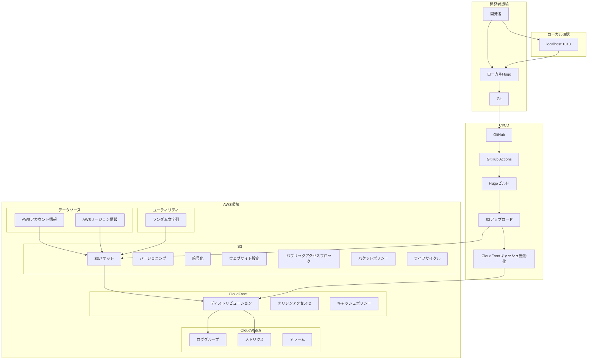
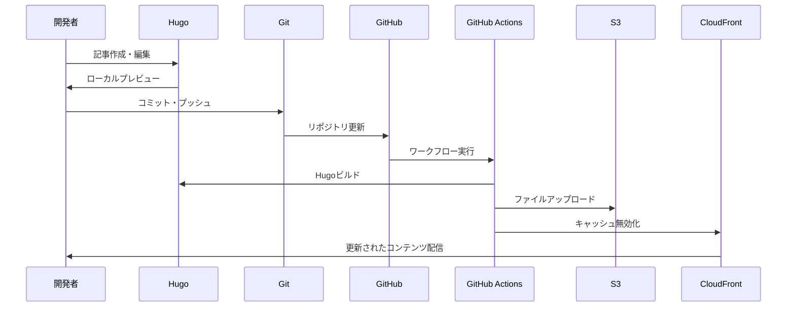

# AWS + Hugo テックブログ システム設計書

## 概要

本ドキュメントは、AWS と Hugo を組み合わせた静的テックブログのシステム設計を定義します。staging 環境として、ローカル開発・テスト用途に特化した設計となっています。

## 設計方針

### 基本方針

- **シンプル性**: 必要最小限の AWS リソースで構成
- **ローカル優先**: 開発・テストはローカル環境で完結
- **コスト最適化**: AWS 無料枠を最大限活用
- **自動化**: CI/CD によるデプロイ自動化

### 制約事項

- **ドメイン管理**: staging 環境ではドメイン設定を行わない
- **SSL 証明書**: ACM 証明書は使用しない
- **マルチ AZ**: シングル AZ 構成（staging 環境のため）
- **外部アクセス**: ローカル開発者からのみアクセス

## システムアーキテクチャ

### 全体構成図



### システム構成要素

| 要素           | 技術              | 役割                       | 環境     |
| -------------- | ----------------- | -------------------------- | -------- |
| 静的サイト生成 | Hugo              | Markdown から HTML 生成    | ローカル |
| バージョン管理 | Git               | ソースコード管理           | ローカル |
| CI/CD          | GitHub Actions    | 自動ビルド・デプロイ       | GitHub   |
| データソース   | AWS Provider      | アカウント・リージョン情報 | AWS      |
| ユーティリティ | Random Provider   | ランダム文字列生成         | AWS      |
| ストレージ     | Amazon S3         | 静的ファイルホスティング   | AWS      |
| CDN            | Amazon CloudFront | 高速配信・キャッシュ       | AWS      |
| 監視           | Amazon CloudWatch | ログ・メトリクス管理       | AWS      |

## データフロー

### 1. 開発フロー



### 2. デプロイフロー

1. **ローカル開発**

   - Hugo で記事作成・編集
   - `hugo server -D`でローカル確認
   - Git でコミット・プッシュ

2. **CI/CD 実行**

   - GitHub Actions が自動実行
   - Hugo で静的サイトをビルド
   - S3 バケットにファイルをアップロード
   - CloudFront のキャッシュを無効化

3. **配信**
   - CloudFront が S3 からコンテンツを取得
   - エッジロケーションでキャッシュ
   - 開発者に高速配信

## ファイル構造設計

### Hugo サイト構造

```bash
hugo-site/
├── config.toml              # Hugo設定ファイル
├── content/                 # 記事コンテンツ
│   ├── posts/              # ブログ記事
│   ├── pages/              # 固定ページ
│   └── _index.md           # トップページ
├── layouts/                 # テンプレート
│   ├── _default/           # デフォルトレイアウト
│   ├── partials/           # 部分テンプレート
│   └── shortcodes/         # ショートコード
├── static/                  # 静的ファイル
│   ├── images/             # 画像ファイル
│   ├── css/                # スタイルシート
│   └── js/                 # JavaScript
└── themes/                  # Hugoテーマ
    └── PaperMod/           # 使用テーマ
```

### Terraform 構造

```bash
terraform/
├── main.tf                  # メイン設定（データソース、ローカル変数、リソース定義）
├── variables.tf             # 変数定義（プロジェクト、S3、CloudFront、タグ、ローカル設定）
├── outputs.tf               # 出力定義（プロジェクト情報、S3、CloudFront、接続情報）
├── provider.tf              # プロバイダー設定（AWS、Random）
├── terraform.tfvars         # 変数値（環境固有の設定）
└── modules/                 # モジュール
    ├── s3/                  # S3バケット
    │   ├── main.tf         # バケット、バージョニング、暗号化、ウェブサイト設定
    │   ├── variables.tf    # 入力変数
    │   └── outputs.tf      # 出力変数
    └── cloudfront/          # CloudFront
        ├── main.tf         # ディストリビューション、OAI、キャッシュポリシー
        ├── variables.tf    # 入力変数
        └── outputs.tf      # 出力変数
```

## セキュリティ設計

### 認証・認可

#### IAM 設計

**※ 既存の IAM ユーザーを使用（手動で作成済み）**

- **最小権限の原則**: 必要最小限の権限のみ付与
- **アクセスキーローテーション**: 90 日ごとの更新
- **アクセスキー管理**: `credentials/iam-users/`で安全に管理

#### リソースアクセス制御

- **S3 バケット**: CloudFront からのみアクセス可能（一時的に無効化）
- **CloudFront**: 公開アクセス（staging 環境のため）
- **CloudWatch**: ログ保持期間 30 日

### データ保護

#### 暗号化

- **S3**: AES256 暗号化（全オブジェクト）
- **転送時**: HTTPS 通信（CloudFront 経由、TLSv1 以上）
- **ログ**: CloudWatch で暗号化

#### バックアップ

- **ソースコード**: Git リポジトリで管理
- **設定ファイル**: Terraform で管理（tfstate ファイル）
- **コンテンツ**: S3 バージョニングで管理（30 日間）
- **ライフサイクル**: 古いバージョンは 60 日後に削除

## パフォーマンス設計

### キャッシュ戦略

#### CloudFront キャッシュ

- **TTL 設定**:
  - デフォルト: 86400 秒（24 時間）
  - 最小: 0 秒
  - 最大: 31536000 秒（1 年）
- **キャッシュ無効化**: デプロイ時に自動実行
- **圧縮**: gzip 圧縮を有効化
- **キャッシュポリシー**: Custom-CachingOptimized
  - クッキー: キャッシュ対象外
  - ヘッダー: キャッシュ対象外
  - クエリ文字列: キャッシュ対象外

#### Hugo 最適化

- **ビルド最適化**: `--minify`オプションで圧縮
- **アセット最適化**: CSS/JS/画像の最適化
- **テンプレート最適化**: 効率的なレイアウト設計

### スケーラビリティ

#### 水平スケーリング

- **CloudFront**: エッジロケーションによる自動スケーリング
- **S3**: 自動的な容量拡張

#### 垂直スケーリング

- **Hugo**: ローカル環境でのビルド性能向上
- **GitHub Actions**: 必要に応じたリソース割り当て

## 障害対策設計

### 可用性設計

#### 冗長化

- **S3**: 99.99%の可用性（AWS 標準）
- **CloudFront**: 99.9%の可用性
- **GitHub**: 99.9%の可用性

#### フェイルオーバー

- **ローカル環境**: Hugo サーバーによる代替確認
- **S3 障害時**: ローカルファイルでの動作確認
- **CloudFront 障害時**: S3 直接アクセスでの確認

### 復旧設計

#### データ復旧

- **Git**: リポジトリからの復旧
- **S3**: バージョニングによる復旧
- **Terraform**: 状態ファイルからの復旧

#### 手順書

- **障害対応手順**: 運用・保守手順書に記載
- **復旧手順**: 段階的な復旧プロセス
- **連絡体制**: 開発者間での情報共有

## コスト設計

### コスト構成

| サービス   | 月額コスト | 備考                       |
| ---------- | ---------- | -------------------------- |
| S3         | $0.00      | 5GB 以内（無料枠）         |
| CloudFront | $0.00      | 1TB 以内（無料枠）         |
| CloudWatch | $0.00      | 基本メトリクス（無料）     |
| データ転送 | $0.00      | 無料枠内                   |
| 合計       | $0.00      | staging 環境のため無料枠内 |

### コスト最適化

#### 無料枠の活用

- **S3**: 5GB まで無料
- **CloudFront**: 1TB まで無料
- **IAM**: 完全無料

#### 使用量監視

- **CloudWatch**: メトリクス監視
- **コストアラート**: 予算超過防止
- **使用量分析**: 月次レポート

## 変更管理設計

### バージョン管理

#### ソースコード

- **Git**: 機能単位でのブランチ管理
- **タグ**: リリースバージョンの管理
- **コミット**: 意味のある単位での分割

#### インフラ

- **Terraform**: 状態ファイルでの管理
- **モジュール**: 再利用可能な構成
- **環境分離**: staging/production 環境の分離

### 変更プロセス

1. **計画**: 変更内容の設計・レビュー
2. **実装**: ローカル環境での開発・テスト
3. **デプロイ**: CI/CD による自動デプロイ
4. **確認**: 動作確認・テスト
5. **文書化**: 変更内容の記録

## 設計チェックリスト

### システム設計

- [x] アーキテクチャ図が作成されている
- [x] データフローが定義されている
- [x] セキュリティ要件が満たされている
- [x] パフォーマンス要件が満たされている

### インフラ設計

- [x] AWS リソースが適切に設計されている
- [x] データソースが適切に設定されている
- [x] ユーティリティリソースが設計されている
- [x] S3 バケットが適切に設定されている
- [x] CloudFront が最適化されている
- [x] CloudWatch の監視が設定されている
- [x] セキュリティ設定が適切である
- [x] コストが最適化されている

### 運用設計

- [x] 監視・ログが設定されている（CloudWatch）
- [x] 障害対応手順が定義されている
- [x] バックアップ・復旧が計画されている
- [x] 変更管理プロセスが定義されている

### 現在の環境固有の項目

- [x] S3 バケット名が自動生成されている（techblog-staging-staging-bucket-ud83sqdw）
- [x] CloudFront ディストリビューションが作成されている（E3IY2D06Y9FT5D）
- [x] CloudFront ドメインが利用可能である（d3bflftl7cln1y.cloudfront.net）
- [x] S3 バケットポリシーが一時的に無効化されている（循環依存回避）
- [x] CloudWatch ロググループが作成されている（/aws/cloudfront/techblog-staging-staging）

## 変更履歴

| 日付       | バージョン | 変更内容 | 変更者 |
| ---------- | ---------- | -------- | ------ |
| 202x-xx-XX | 1.0.0      | 初版作成 | -      |

---

## 注意事項

- 本設計書は staging 環境用の設計です
- 本番環境では追加のセキュリティ・可用性要件が必要です
- 設計変更時は必ずレビューを実施してください
- 定期的な設計の見直しを行ってください

### 現在の環境固有の注意事項

- **S3 バケット名**: `techblog-staging-staging-bucket-ud83sqdw`（自動生成）
- **CloudFront ディストリビューション ID**: `E3IY2D06Y9FT5D`
- **CloudFront ドメイン**: `d3bflftl7cln1y.cloudfront.net`
- **CloudWatch ロググループ**: `/aws/cloudfront/techblog-staging-staging`
- **S3 バケットポリシー**: 一時的に無効化（循環依存回避のため）
- **オリジンアクセスアイデンティティ**: `E25WKYHIDWKBQP`
- **カスタムキャッシュポリシー**: `Custom-CachingOptimized`
