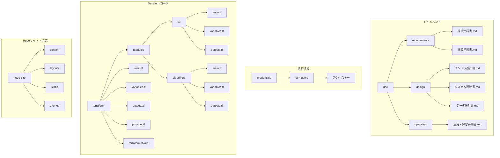

# AWS + Hugo テックブログ データ設計書

## 概要

本ドキュメントは、AWS と Hugo を組み合わせた静的テックブログのデータ設計を定義します。Hugo サイトのコンテンツ構造、メタデータ、ファイル管理について詳細に記述しています。

## データ設計方針

### 基本方針

- **構造化**: 一貫性のあるコンテンツ構造
- **拡張性**: 将来の機能追加に対応可能
- **保守性**: 管理しやすいファイル構成
- **SEO 対応**: 検索エンジン最適化

### 制約事項

- **静的サイト**: データベースは使用しない
- **Markdown**: コンテンツは Markdown 形式
- **ファイルベース**: ファイルシステムで管理
- **バージョン管理**: Git で管理

## コンテンツ構造設計

### 全体構造

```bash
techblog-staging/
├── doc/                    # ドキュメント
│   ├── requirements/       # 要件定義
│   ├── design/            # 設計書
│   └── operation/         # 運用・保守
├── credentials/           # 認証情報（非Git管理）
│   └── iam-users/        # IAMユーザー情報
├── terraform/             # Terraformコード
│   ├── modules/          # モジュール
│   │   ├── s3/          # S3モジュール
│   │   └── cloudfront/  # CloudFrontモジュール
│   ├── main.tf          # メイン設定
│   ├── variables.tf     # 変数定義
│   ├── outputs.tf       # 出力定義
│   ├── provider.tf      # プロバイダー設定
│   └── terraform.tfvars # 変数値
└── hugo-site/            # Hugoサイト（予定）
    ├── content/          # コンテンツ
    ├── layouts/          # テンプレート
    ├── static/          # 静的ファイル
    └── themes/          # テーマ
```

### コンテンツ階層



## フロントマター設計

### 基本フロントマター

#### ブログ記事（posts/）

```yaml
---
title: "記事タイトル"
date: 2024-01-01T00:00:00+09:00
lastmod: 2024-01-01T00:00:00+09:00
draft: false
description: "記事の概要説明（SEO用）"
keywords: ["キーワード1", "キーワード2"]
tags: ["タグ1", "タグ2"]
categories: ["カテゴリ1"]
author: "著者名"
image: "images/featured-image.jpg"
toc: true
readingTime: true
showToc: true
showReadingTime: true
showDate: true
showAuthor: true
showSummary: true
---
記事の本文...
```

#### 固定ページ（pages/）

```yaml
---
title: "ページタイトル"
date: 2024-01-01T00:00:00+09:00
lastmod: 2024-01-01T00:00:00+09:00
draft: false
description: "ページの概要説明"
keywords: ["キーワード1", "キーワード2"]
layout: "page"
menu:
  main:
    name: "メニュー名"
    weight: 10
---
ページの本文...
```

#### カテゴリページ（categories/）

```yaml
---
title: "カテゴリ名"
date: 2024-01-01T00:00:00+09:00
draft: false
description: "カテゴリの説明"
layout: "category"
---
カテゴリの説明文...
```

#### タグページ（tags/）

```yaml
---
title: "タグ名"
date: 2024-01-01T00:00:00+09:00
draft: false
description: "タグの説明"
layout: "tag"
---
タグの説明文...
```

### フロントマター項目詳細

#### 必須項目

| 項目    | 型       | 説明                   | 例                          |
| ------- | -------- | ---------------------- | --------------------------- |
| `title` | string   | 記事・ページのタイトル | "Hugo でブログを作成する"   |
| `date`  | datetime | 作成日時               | "2024-01-01T00:00:00+09:00" |
| `draft` | boolean  | 下書きフラグ           | false                       |

#### 推奨項目

| 項目          | 型     | 説明             | 例                                  |
| ------------- | ------ | ---------------- | ----------------------------------- |
| `description` | string | SEO 用の説明文   | "Hugo を使った静的サイトの作成方法" |
| `keywords`    | array  | SEO 用キーワード | ["Hugo", "静的サイト", "ブログ"]    |
| `tags`        | array  | 記事のタグ       | ["Hugo", "AWS", "Terraform"]        |
| `categories`  | array  | 記事のカテゴリ   | ["技術", "インフラ"]                |
| `author`      | string | 著者名           | "開発者名"                          |
| `image`       | string | アイキャッチ画像 | "images/featured.jpg"               |

#### オプション項目

| 項目          | 型       | 説明           | 例                          |
| ------------- | -------- | -------------- | --------------------------- |
| `toc`         | boolean  | 目次の表示     | true                        |
| `readingTime` | boolean  | 読了時間の表示 | true                        |
| `lastmod`     | datetime | 最終更新日時   | "2024-01-01T00:00:00+09:00" |
| `layout`      | string   | レイアウト指定 | "post", "page"              |

## コンテンツ分類設計

### カテゴリ設計

#### メインカテゴリ

| カテゴリ名 | 説明             | 記事例                   | 重み |
| ---------- | ---------------- | ------------------------ | ---- |
| 技術       | 技術的な内容全般 | AWS、Terraform、Hugo     | 10   |
| インフラ   | インフラ関連     | AWS、Docker、Kubernetes  | 20   |
| 開発       | 開発関連         | プログラミング、ツール   | 30   |
| 運用       | 運用・保守       | 監視、ログ、バックアップ | 40   |
| その他     | その他の内容     | 雑記、感想               | 50   |

#### サブカテゴリ

```text
技術/
├── AWS/                    # AWS関連
├── Terraform/              # Terraform関連
├── Hugo/                   # Hugo関連
└── その他/                 # その他の技術

インフラ/
├── クラウド/               # クラウドインフラ
├── コンテナ/               # コンテナ技術
├── ネットワーク/            # ネットワーク
└── セキュリティ/            # セキュリティ

開発/
├── プログラミング/          # プログラミング言語
├── ツール/                 # 開発ツール
├── フレームワーク/          # フレームワーク
└── ベストプラクティス/      # 開発手法
```

### タグ設計

#### 技術タグ

| タグ名     | 説明                     | 使用頻度 |
| ---------- | ------------------------ | -------- |
| AWS        | Amazon Web Services      | 高       |
| Terraform  | インフラのコード化       | 高       |
| Hugo       | 静的サイトジェネレーター | 高       |
| S3         | オブジェクトストレージ   | 中       |
| CloudFront | CDN サービス             | 中       |
| IAM        | 認証・認可               | 中       |

#### レベルタグ

| タグ名 | 説明                     | 対象者       |
| ------ | ------------------------ | ------------ |
| 初心者 | プログラミング初心者向け | 初学者       |
| 中級者 | ある程度の経験者向け     | 経験者       |
| 上級者 | 高度な技術者向け         | エキスパート |

## メディアファイル設計

### 画像ファイル

#### ディレクトリ構造

```bash
static/
├── images/
│   ├── posts/              # 記事用画像
│   │   ├── 2024-01-01-title/
│   │   │   ├── featured.jpg    # アイキャッチ画像
│   │   │   ├── diagram.png     # 図表
│   │   │   └── screenshot.png  # スクリーンショット
│   │   └── 2024-01-02-title/
│   ├── pages/              # 固定ページ用画像
│   │   ├── about/
│   │   └── contact/
│   ├── common/             # 共通画像
│   │   ├── logo.png        # ロゴ
│   │   ├── favicon.ico     # ファビコン
│   │   └── avatar.jpg      # 著者アバター
│   └── icons/              # アイコン
│       ├── social/         # SNSアイコン
│       └── ui/             # UIアイコン
```

#### 画像命名規則

| 用途               | 命名規則                  | 例                  |
| ------------------ | ------------------------- | ------------------- |
| アイキャッチ画像   | `featured.{ext}`          | `featured.jpg`      |
| 図表               | `diagram-{番号}.{ext}`    | `diagram-01.png`    |
| スクリーンショット | `screenshot-{番号}.{ext}` | `screenshot-01.png` |
| ロゴ               | `logo.{ext}`              | `logo.png`          |
| ファビコン         | `favicon.{ext}`           | `favicon.ico`       |

#### 画像最適化

| 項目         | 設定                              | 理由               |
| ------------ | --------------------------------- | ------------------ |
| 形式         | WebP 優先、JPG/PNG フォールバック | ファイルサイズ削減 |
| 圧縮         | 高圧縮（品質 80-85%）             | 転送量削減         |
| サイズ       | 最大 1920px 幅                    | 高解像度対応       |
| レスポンシブ | 複数サイズ生成                    | デバイス最適化     |

### その他のメディアファイル

#### ファイル形式

| ファイル種別 | 推奨形式       | 代替形式 | 理由     |
| ------------ | -------------- | -------- | -------- |
| 画像         | WebP, JPG, PNG | SVG      | 圧縮効率 |
| 動画         | MP4            | WebM     | 互換性   |
| 音声         | MP3            | OGG      | 互換性   |
| ドキュメント | PDF            | -        | 標準性   |

#### ファイルサイズ制限

| ファイル種別     | 推奨サイズ | 最大サイズ | 理由         |
| ---------------- | ---------- | ---------- | ------------ |
| アイキャッチ画像 | 100-300KB  | 500KB      | 読み込み速度 |
| 図表             | 50-200KB   | 1MB        | 表示速度     |
| 動画             | 5-20MB     | 50MB       | 転送量       |
| 音声             | 1-5MB      | 10MB       | 転送量       |

## リンク構造設計

### 内部リンク

#### 記事間リンク

```markdown
<!-- 関連記事へのリンク -->

関連記事: [AWS S3 の設定方法](/posts/2024-01-01-aws-s3-setup/)

<!-- カテゴリページへのリンク -->

カテゴリ: [インフラ](/categories/infrastructure/)

<!-- タグページへのリンク -->

タグ: [AWS](/tags/aws/)
```

#### ナビゲーション構造

```text
トップページ
├── 記事一覧
│   ├── 最新記事
│   ├── カテゴリ別
│   └── タグ別
├── 固定ページ
│   ├── このブログについて
│   ├── お問い合わせ
│   └── プライバシーポリシー
└── サイドバー
    ├── プロフィール
    ├── カテゴリ一覧
    ├── タグクラウド
    └── 最新記事
```

### 外部リンク

#### リンク管理

| リンク種別         | 管理方法       | 例                   |
| ------------------ | -------------- | -------------------- |
| 技術ドキュメント   | 定期的な確認   | AWS 公式ドキュメント |
| ツール・ライブラリ | バージョン管理 | Hugo 公式サイト      |
| 参考記事           | アーカイブ化   | 技術ブログ記事       |
| SNS                | 動的更新       | Twitter、GitHub      |

#### リンクポリシー

- **信頼性**: 信頼できる情報源のみリンク
- **更新性**: 定期的なリンク切れチェック
- **関連性**: 記事内容と関連するリンクのみ
- **アクセシビリティ**: 外部リンクの明示

## メタデータ設計

### SEO メタデータ

#### HTML メタタグ

```html
<!-- 基本メタタグ -->
<meta name="description" content="記事の説明文" />
<meta name="keywords" content="キーワード1,キーワード2" />
<meta name="author" content="著者名" />

<!-- Open Graph -->
<meta property="og:title" content="記事タイトル" />
<meta property="og:description" content="記事の説明文" />
<meta property="og:image" content="アイキャッチ画像URL" />
<meta property="og:type" content="article" />

<!-- Twitter Card -->
<meta name="twitter:card" content="summary_large_image" />
<meta name="twitter:title" content="記事タイトル" />
<meta name="twitter:description" content="記事の説明文" />
<meta name="twitter:image" content="アイキャッチ画像URL" />
```

#### 構造化データ（JSON-LD）

```json
{
  "@context": "https://schema.org",
  "@type": "BlogPosting",
  "headline": "記事タイトル",
  "description": "記事の説明文",
  "author": {
    "@type": "Person",
    "name": "著者名"
  },
  "datePublished": "2024-01-01T00:00:00+09:00",
  "dateModified": "2024-01-01T00:00:00+09:00",
  "publisher": {
    "@type": "Organization",
    "name": "ブログ名"
  }
}
```

### 統計・分析メタデータ

#### アクセス解析

| 項目                  | 用途               | 設定方法                   |
| --------------------- | ------------------ | -------------------------- |
| Google Analytics      | アクセス解析       | トラッキングコード埋め込み |
| Google Search Console | 検索パフォーマンス | サイトマップ送信           |
| ヒートマップ          | ユーザー行動分析   | ツール埋め込み             |

#### パフォーマンス測定

| 項目            | 用途                 | 測定方法           |
| --------------- | -------------------- | ------------------ |
| Core Web Vitals | ページパフォーマンス | Lighthouse         |
| 読み込み速度    | 表示速度             | PageSpeed Insights |
| SEO スコア      | 検索最適化           | Lighthouse         |

## データ管理設計

### バージョン管理

#### Git 管理

| ファイル種別     | 管理方法 | 除外項目             |
| ---------------- | -------- | -------------------- |
| Terraform コード | 完全管理 | tfplan, tfstate      |
| ドキュメント     | 完全管理 | -                    |
| 認証情報         | 除外     | credentials/         |
| 機密ファイル     | 除外     | _.key, _.pem, \*.csv |
| Hugo サイト      | 完全管理 | public/              |

#### .gitignore 設定

```gitignore
# Terraform関連
*.tfstate
*.tfstate.*
*.tfplan
*.tfvars
!example.tfvars
.terraform/

# 認証情報・機密ファイル
credentials/
secrets/
*.key
*.pem
*.p12
*.pfx
*.csv

# Hugo関連
public/
resources/
.hugo_build.lock

# IDE・エディタ
.vscode/
.idea/
*.swp
*.swo

# OS関連
.DS_Store
Thumbs.db

# その他
*.log
.env
.env.local
node_modules/
```

### バックアップ・復旧

#### バックアップ戦略

| データ種別       | バックアップ方法  | 頻度         | 保持期間 |
| ---------------- | ----------------- | ------------ | -------- |
| Terraform コード | Git リポジトリ    | リアルタイム | 永続     |
| ドキュメント     | Git リポジトリ    | リアルタイム | 永続     |
| S3 コンテンツ    | S3 バージョニング | 自動         | 30 日    |
| 古いバージョン   | S3 ライフサイクル | 自動         | 60 日    |
| 認証情報         | ローカル保管      | 手動         | 90 日    |

#### 復旧手順

1. **Terraform コード復旧**:

   - Git リポジトリからコードを復旧
   - `terraform init`で初期化
   - `terraform plan`で状態確認
   - `terraform apply`で再適用

2. **S3 コンテンツ復旧**:

   - バージョニングから特定バージョンを復元
   - ライフサイクルルールの確認
   - CloudFront キャッシュの無効化

3. **認証情報復旧**:

   - ローカルバックアップから復旧
   - アクセスキーの再生成（必要な場合）
   - 権限の再確認

4. **動作確認**:
   - S3 バケットのアクセス確認
   - CloudFront の配信確認
   - ログ・メトリクスの確認

## データ設計チェックリスト

### プロジェクト構造

- [x] ディレクトリ構造が適切に設計されている
- [x] ドキュメントが体系的に整理されている
- [x] Terraform コードが適切に構造化されている
- [x] 認証情報が安全に管理されている

### Terraform データ

- [x] モジュール構造が適切に設計されている
- [x] 変数・出力が明確に定義されている
- [x] リソース間の依存関係が整理されている
- [x] 状態管理が適切に設定されている

### セキュリティ管理

- [x] 機密情報が適切に保護されている
- [x] アクセスキーが安全に管理されている
- [x] バックアップが適切に設定されている
- [x] 復旧手順が明確に定義されている

### バージョン管理

- [x] Git の管理対象が適切に設定されている
- [x] .gitignore が正しく構成されている
- [x] S3 バージョニングが有効化されている
- [x] ライフサイクルルールが設定されている

### 現在の環境固有の項目

- [x] S3 バケット名が自動生成されている（techblog-staging-staging-bucket-ud83sqdw）
- [x] CloudFront ディストリビューションが作成されている（E3IY2D06Y9FT5D）
- [x] CloudFront ドメインが利用可能である（d3bflftl7cln1y.cloudfront.net）
- [x] S3 バケットポリシーが一時的に無効化されている（循環依存回避）
- [x] CloudWatch ロググループが作成されている（/aws/cloudfront/techblog-staging-staging）

## 変更履歴

| 日付       | バージョン | 変更内容 | 変更者 |
| ---------- | ---------- | -------- | ------ |
| 202x-xx-XX | 1.0.0      | 初版作成 | -      |

---

## 注意事項

- 本設計書は staging 環境用の設計です
- 本番環境では追加のセキュリティ・可用性要件が必要です
- 設計変更時は必ずレビューを実施してください
- 定期的な設計の見直しを行ってください
- データの整合性とセキュリティを常に確認してください

### 現在の環境固有の注意事項

- **S3 バケット名**: `techblog-staging-staging-bucket-ud83sqdw`（自動生成）
- **CloudFront ディストリビューション ID**: `E3IY2D06Y9FT5D`
- **CloudFront ドメイン**: `d3bflftl7cln1y.cloudfront.net`
- **CloudWatch ロググループ**: `/aws/cloudfront/techblog-staging-staging`
- **S3 バケットポリシー**: 一時的に無効化（循環依存回避のため）
- **オリジンアクセスアイデンティティ**: `E25WKYHIDWKBQP`
- **カスタムキャッシュポリシー**: `Custom-CachingOptimized`
- **認証情報の保管場所**: `credentials/iam-users/`（非 Git 管理）
