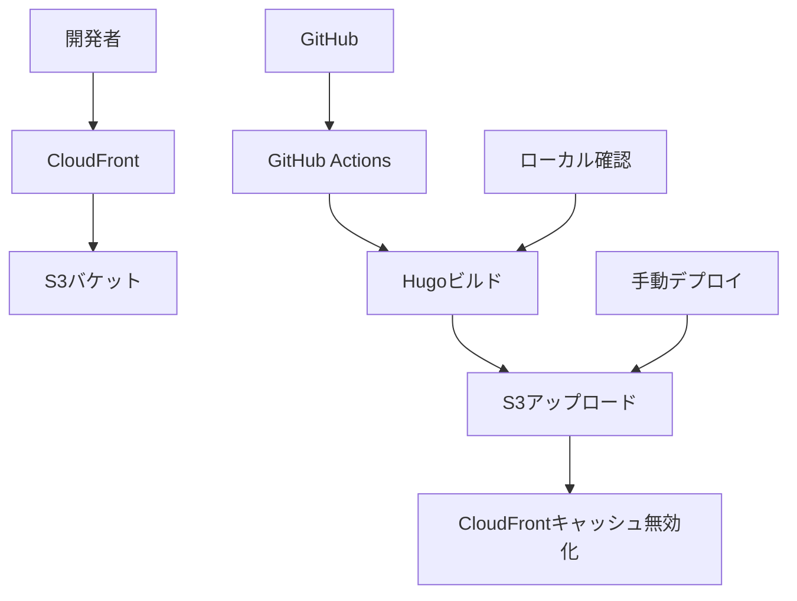

# 🟦 AWS + Hugo テックブログ

## 📋 プロジェクト概要

AWS と Hugo を組み合わせた低コスト・高パフォーマンスな静的テックブログの**staging 環境**です。インフラのコード化（IaC）により、再現性と保守性を重視した設計となっています。

**※ この環境はローカル開発・テスト用途のため、ドメイン設定や SSL 証明書は含まれません。**

## ✨ 特徴

- 🚀 **高速**: Hugo による高速な静的サイト生成
- 💰 **低コスト**: AWS 無料枠を活用した経済的な運用
- 🔒 **セキュア**: HTTPS 強制、最小権限の原則
- 🛠️ **自動化**: GitHub Actions による CI/CD パイプライン
- 📱 **レスポンシブ**: モバイルファーストのデザイン
- 🌍 **グローバル**: CloudFront による高速配信

## 🏗️ アーキテクチャ



## 🛠️ 技術スタック

| カテゴリ       | 技術              | バージョン |
| -------------- | ----------------- | ---------- |
| 静的サイト生成 | Hugo              | 0.121.1+   |
| ホスティング   | Amazon S3         | -          |
| CDN            | Amazon CloudFront | -          |
| インフラ管理   | Terraform         | 1.0.0+     |
| CI/CD          | GitHub Actions    | -          |
| 監視           | Amazon CloudWatch | -          |

## 📁 プロジェクト構成

```bash
techblog-staging/
├── doc/                           # ドキュメント
│   ├── README.md                 # このファイル
│   ├── 技術仕様書.md             # 技術的な詳細
│   ├── 構築手順書.md             # 構築手順
│   └── 運用・保守手順書.md       # 運用・保守手順
├── hugo-site/                    # Hugoプロジェクト
├── terraform/                    # Terraform設定
│   └── modules/                  # Terraformモジュール
│       ├── s3/                   # S3バケット構成
│       ├── cloudfront/           # CloudFront構成
│       └── iam/                  # IAMユーザー・ポリシー
├── .github/workflows/            # GitHub Actions
└── scripts/                      # 補助スクリプト
```

## 🚀 クイックスタート

### 前提条件

- AWS アカウント
- GitHub アカウント
- ローカル環境に以下のソフトウェアがインストール済み：
  - AWS CLI
  - Terraform
  - Hugo
  - Git

### 1. リポジトリのクローン

```bash
git clone https://github.com/your-username/techblog-staging.git
cd techblog-staging
```

### 2. 環境変数の設定

```bash
# AWS認証情報の設定
aws configure

# プロジェクト固有の変数設定
cp terraform/terraform.tfvars.example terraform/terraform.tfvars
# terraform.tfvarsを編集して必要な値を設定
```

### 3. インフラの構築

```bash
cd terraform
terraform init
terraform plan
terraform apply
```

### 4. Hugo サイトの設定

```bash
cd hugo-site
hugo new site . --force
# テーマの設定と記事の作成
hugo server -D  # ローカルでの確認
```

### 5. CI/CD の設定

1. GitHub Secrets の設定
2. 初回デプロイの実行

詳細な手順は [構築手順書](構築手順書.md) を参照してください。

## 📚 ドキュメント

- **[技術仕様書](技術仕様書.md)**: システムの技術的な詳細
- **[構築手順書](構築手順書.md)**: 段階的な構築手順
- **[運用・保守手順書](運用・保守手順書.md)**: 日常運用とトラブル対応

## 💰 コスト

### 無料枠（月額）

| サービス   | 無料枠 | 備考       |
| ---------- | ------ | ---------- |
| S3         | 5GB    | ストレージ |
| CloudFront | 1TB    | 転送量     |

### 想定月額コスト（小規模サイト）

- **S3**: $0.00（5GB 以内）
- **CloudFront**: $0.00（1TB 以内）
- **その他**: $0.00〜$0.50

**合計**: $0.00〜$0.50/月

## 🔒 セキュリティ

### 実装されているセキュリティ対策

- S3 バケットの公開アクセス制限
- CloudFront からのみ S3 へのアクセス許可
- IAM ユーザーの最小権限設定
- 定期的なセキュリティアップデート

### セキュリティ監査

- 月次セキュリティチェック
- 脆弱性スキャンの定期実行
- アクセスログの監視
- セキュリティインシデントの記録

## 📊 パフォーマンス

### 目標値

- **ページ読み込み時間**: 2 秒以内
- **Hugo ビルド時間**: 1 秒以内
- **可用性**: 99.9%以上
- **SEO スコア**: 90 点以上

### 最適化手法

- Hugo による高速ビルド
- CloudFront による CDN 配信
- 画像の最適化
- CSS/JS の圧縮
- キャッシュ戦略の最適化

## 🚨 トラブルシューティング

### よくある問題

1. **サイトが表示されない**

   - S3 バケットの設定確認
   - CloudFront のキャッシュ無効化

2. **デプロイが失敗する**
   - GitHub Secrets の確認
   - IAM 権限の確認
   - AWS 認証情報の確認

詳細な対処法は [運用・保守手順書](運用・保守手順書.md) を参照してください。

## 🤝 コントリビューション

### 開発フロー

1. Issue の作成
2. フィーチャーブランチの作成
3. 変更の実装
4. テストの実行
5. プルリクエストの作成
6. コードレビュー
7. マージ

### コーディング規約

- コミットメッセージは日本語で記述
- プレフィックス（feat:, fix:, docs:等）を使用
- コードは可読性を重視
- ドキュメントの更新を忘れずに

## 📞 サポート

### 質問・相談

- **GitHub Issues**: バグ報告や機能要望
- **GitHub Discussions**: 一般的な質問や議論
- **ドキュメント**: 各手順書の参照

### 緊急時

- **障害報告**: GitHub Issues で`[緊急]`タグを使用
- **セキュリティ問題**: プライベートで報告

## 📄 ライセンス

このプロジェクトは [MIT License](LICENSE) の下で公開されています。

## 🙏 謝辞

- [Hugo](https://gohugo.io/) - 高速な静的サイトジェネレーター
- [AWS](https://aws.amazon.com/) - クラウドインフラストラクチャ
- [Terraform](https://www.terraform.io/) - インフラのコード化
- [GitHub Actions](https://github.com/features/actions) - CI/CD プラットフォーム

## 🔄 変更履歴

| バージョン | 日付       | 変更内容     |
| ---------- | ---------- | ------------ |
| 1.0.0      | 2024-01-XX | 初回リリース |

---

## 📝 注意事項

- 本プロジェクトは学習・開発目的で作成されています
- 本番環境での使用前に、必ずテスト環境での動作確認を行ってください
- AWS の料金体系や制限事項は定期的に確認してください
- セキュリティ要件は組織のポリシーに合わせて調整してください

---

**Happy Blogging!**🚀
