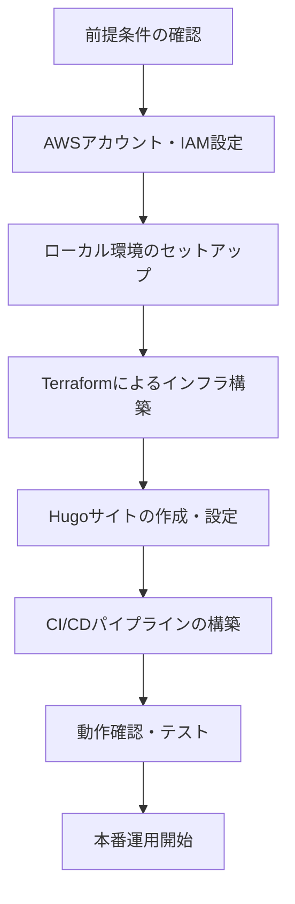

# 🚀 AWS + Hugo テックブログ 構築手順書

## 📋 概要

本ドキュメントは、AWS と Hugo を組み合わせた静的テックブログの構築手順を詳細に説明します。段階的な手順で、初心者でも安全に構築できるよう配慮しています。

## 🎯 構築の流れ



## 🔧 前提条件

### 必要なアカウント・サービス

- AWS アカウント（有効なクレジットカードが必要）
- GitHub アカウント
- ローカル開発・テスト環境のセットアップ

### 必要なソフトウェア

- AWS CLI（最新版）
- Terraform（1.0.0 以上）
- Hugo（最新版）
- Git（最新版）
- テキストエディタ（VS Code 推奨）

## 📋 構築手順

### ステップ 1: AWS アカウント・IAM 設定

#### 1.1 AWS アカウントの作成

1. [AWS 公式サイト](https://aws.amazon.com/)にアクセス
2. 「アカウントを作成」をクリック
3. 必要な情報を入力（メールアドレス、パスワード、アカウント名）
4. 連絡先情報を入力
5. 支払い情報を入力（クレジットカード）
6. 本人確認（SMS または音声通話）
7. サポートプランの選択（無料プラン推奨）
8. アカウント作成完了

#### 1.2 IAM ユーザーの作成

```bash
# AWS CLIでログイン
aws configure

# 以下の情報を入力
AWS Access Key ID: [ルートアカウントのアクセスキー]
AWS Secret Access Key: [ルートアカウントのシークレットキー]
Default region name: ap-northeast-1
Default output format: json
```

#### 1.3 IAM ポリシーの作成

AWS Management Console で以下のいずれかのポリシーを作成してください。学習効果を重視する場合は**オプション 1**を推奨します。

**オプション 1: 段階的な権限付与（推奨・学習効果重視）**:

ポリシー名: `TechBlogStaging-Policy-Limited`

```json
{
  "Version": "2012-10-17",
  "Statement": [
    {
      "Sid": "S3FullAccess",
      "Effect": "Allow",
      "Action": ["s3:*"],
      "Resource": "*"
    },
    {
      "Sid": "CloudFrontFullAccess",
      "Effect": "Allow",
      "Action": ["cloudfront:*"],
      "Resource": "*"
    },
    {
      "Sid": "IAMUserManagement",
      "Effect": "Allow",
      "Action": [
        "iam:CreateUser",
        "iam:DeleteUser",
        "iam:CreateAccessKey",
        "iam:DeleteAccessKey",
        "iam:AttachUserPolicy",
        "iam:DetachUserPolicy",
        "iam:CreatePolicy",
        "iam:DeletePolicy",
        "iam:GetUser",
        "iam:ListUsers",
        "iam:ListAccessKeys",
        "iam:ListAttachedUserPolicies"
      ],
      "Resource": "*"
    },
    {
      "Sid": "CloudWatchFullAccess",
      "Effect": "Allow",
      "Action": ["cloudwatch:*"],
      "Resource": "*"
    },
    {
      "Sid": "CloudWatchLogsFullAccess",
      "Effect": "Allow",
      "Action": ["logs:*"],
      "Resource": "*"
    },
    {
      "Sid": "TerraformStateManagement",
      "Effect": "Allow",
      "Action": [
        "s3:GetObject",
        "s3:PutObject",
        "s3:DeleteObject",
        "s3:ListBucket"
      ],
      "Resource": [
        "arn:aws:s3:::techblog-staging-terraform-state",
        "arn:aws:s3:::techblog-staging-terraform-state/*"
      ]
    }
  ]
}
```

**オプション 2: 管理者権限（開発・テスト用・簡易設定）**:

ポリシー名: `TechBlogStaging-Policy-Admin`

```json
{
  "Version": "2012-10-17",
  "Statement": [
    {
      "Sid": "AdministratorAccess",
      "Effect": "Allow",
      "Action": "*",
      "Resource": "*"
    }
  ]
}
```

**各オプションの特徴**:

| 項目             | オプション 1（段階的） | オプション 2（管理者） |
| ---------------- | ---------------------- | ---------------------- |
| **学習効果**     | ⭐⭐⭐⭐⭐             | ⭐⭐                   |
| **セキュリティ** | ⭐⭐⭐⭐⭐             | ⭐                     |
| **本番移行**     | ⭐⭐⭐⭐⭐             | ⭐⭐                   |
| **設定の複雑さ** | ⭐⭐                   | ⭐⭐⭐⭐⭐             |
| **推奨度**       | **推奨**               | 開発初期のみ           |

**学習効果を重視する場合の推奨事項**:

- **初回構築時**: オプション 2（管理者権限）で素早く環境構築
- **学習段階**: オプション 1（段階的権限）で権限の理解を深める
- **本番移行前**: オプション 1 で最小権限の原則を実践

### ステップ 2: ローカル環境のセットアップ

#### 2.1 必要なソフトウェアのインストール

**macOS（Homebrew 使用）:**

```bash
# Homebrewのインストール（未インストールの場合）
/bin/bash -c "$(curl -fsSL https://raw.githubusercontent.com/Homebrew/install/HEAD/install.sh)"

# 必要なソフトウェアのインストール
brew install awscli
brew install terraform
brew install hugo
brew install git
```

**Ubuntu/Debian:**

```bash
# AWS CLI
curl "https://awscli.amazonaws.com/awscli-exe-linux-x86_64.zip" -o "awscliv2.zip"
unzip awscliv2.zip
sudo ./aws/install

# Terraform
curl -fsSL https://apt.releases.hashicorp.com/gpg | sudo apt-key add -
sudo apt-add-repository "deb [arch=amd64] https://apt.releases.hashicorp.com $(lsb_release -cs)"
sudo apt-get update && sudo apt-get install terraform

# Hugo
sudo apt-get install hugo

# Git
sudo apt-get install git
```

#### 2.2 プロジェクトディレクトリの作成

```bash
# プロジェクトディレクトリの作成
mkdir techblog-staging
cd techblog-staging

# サブディレクトリの作成
mkdir -p hugo-site
mkdir -p terraform
mkdir -p terraform/modules
mkdir -p terraform/modules/s3
mkdir -p terraform/modules/cloudfront
mkdir -p terraform/modules/iam
mkdir -p .github/workflows
mkdir -p scripts
```

### ステップ 3: Terraform によるインフラ構築

#### 3.1 プロバイダー設定ファイルの作成

**terraform/provider.tf:**

```hcl
terraform {
  required_version = ">= 1.0.0"

  required_providers {
    aws = {
      source  = "hashicorp/aws"
      version = "~> 5.0"
    }
  }
}

provider "aws" {
  region = var.aws_region

  default_tags {
    tags = {
      Project     = var.project_name
      Environment = var.environment
      ManagedBy   = "Terraform"
    }
  }
}
```

#### 3.2 変数定義ファイルの作成

**terraform/variables.tf:**

```hcl
variable "aws_region" {
  description = "AWSリージョン"
  type        = string
  default     = "ap-northeast-1"
}

variable "project_name" {
  description = "プロジェクト名"
  type        = string
  default     = "techblog"
}

variable "environment" {
  description = "環境名"
  type        = string
  default     = "production"
}

# staging環境ではドメイン名は使用しない
# variable "domain_name" {
#   description = "ドメイン名"
#   type        = string
# }

variable "bucket_name" {
  description = "S3バケット名"
  type        = string
}
```

#### 3.3 S3 モジュールの作成

**terraform/modules/s3/main.tf:**

```hcl
resource "aws_s3_bucket" "website" {
  bucket = var.bucket_name

  tags = {
    Name = "${var.project_name}-website"
  }
}

resource "aws_s3_bucket_website_configuration" "website" {
  bucket = aws_s3_bucket.website.id

  index_document {
    suffix = "index.html"
  }

  error_document {
    key = "404.html"
  }
}

resource "aws_s3_bucket_public_access_block" "website" {
  bucket = aws_s3_bucket.website.id

  block_public_acls       = true
  block_public_policy     = true
  ignore_public_acls      = true
  restrict_public_buckets = true
}

resource "aws_s3_bucket_policy" "website" {
  bucket = aws_s3_bucket.website.id

  policy = jsonencode({
    Version = "2012-10-17"
    Statement = [
      {
        Sid       = "AllowCloudFrontAccess"
        Effect    = "Allow"
        Principal = {
          AWS = var.cloudfront_origin_access_identity_arn
        }
        Action   = "s3:GetObject"
        Resource = "${aws_s3_bucket.website.arn}/*"
      }
    ]
  })
}
```

#### 3.4 メイン設定ファイルの作成

**terraform/main.tf:**

```hcl
module "s3" {
  source = "./modules/s3"

  bucket_name = var.bucket_name
  project_name = var.project_name
  cloudfront_origin_access_identity_arn = module.cloudfront.origin_access_identity_arn
}

module "cloudfront" {
  source = "./modules/cloudfront"

  bucket_domain_name = module.s3.bucket_domain_name
  # staging環境ではドメイン名とSSL証明書は使用しない
}
```

#### 3.5 変数値の設定

**terraform/terraform.tfvars:**

```hcl
aws_region = "ap-northeast-1"
project_name = "techblog-staging"
environment = "staging"
# staging環境ではドメイン名は設定しない
bucket_name = "your-unique-bucket-name-staging"
```

#### 3.6 インフラの構築

```bash
cd terraform

# Terraformの初期化
terraform init

# 実行計画の確認
terraform plan

# インフラの構築
terraform apply
```

### ステップ 4: Hugo サイトの作成・設定

#### 4.1 Hugo サイトの初期化

```bash
cd hugo-site

# Hugoサイトの作成
hugo new site . --force

# テーマの追加（例：PaperMod）
git init
git submodule add --depth=1 https://github.com/adityatelange/hugo-PaperMod.git themes/PaperMod
```

#### 4.2 設定ファイルの編集

**hugo-site/config.toml:**

```toml
# staging環境ではローカル確認用の設定
baseURL = 'http://localhost:1313/'
languageCode = 'ja-jp'
title = 'My Tech Blog (Staging)'
theme = 'PaperMod'

[params]
  description = "技術ブログ"
  author = "Your Name"

[menu]
  [[menu.main]]
    identifier = "posts"
    name = "Posts"
    url = "/posts/"
    weight = 10
  [[menu.main]]
    identifier = "tags"
    name = "Tags"
    url = "/tags/"
    weight = 20
  [[menu.main]]
    identifier = "categories"
    name = "Categories"
    url = "/categories/"
    weight = 30

[markup]
  [markup.goldmark]
    [markup.goldmark.renderer]
      unsafe = true
```

#### 4.3 サンプル記事の作成

```bash
# 記事の作成
hugo new posts/first-post.md

# 記事の編集
cat > content/posts/first-post.md << 'EOF'
---
title: "初回投稿"
date: 2024-01-XX
draft: false
tags: ["hugo", "aws"]
categories: ["技術"]
---

# 初回投稿

これは初回の投稿です。

## Hugoについて

Hugoは高速な静的サイトジェネレーターです。

## AWSについて

AWSはクラウドコンピューティングサービスです。
EOF
```

#### 4.4 サイトのビルドとテスト

```bash
# サイトのビルド
hugo

# ローカルサーバーでの確認
hugo server -D
```

### ステップ 5: CI/CD パイプラインの構築

#### 5.1 GitHub Actions ワークフローの作成

**.github/workflows/deploy.yml:**

```yaml
name: Deploy Hugo Blog to AWS

on:
  push:
    branches:
      - main

jobs:
  build-and-deploy:
    runs-on: ubuntu-latest

    env:
      AWS_REGION: ap-northeast-1
      S3_BUCKET: your-bucket-name
      CLOUDFRONT_DISTRIBUTION_ID: your-distribution-id

    steps:
      - name: Checkout repository
        uses: actions/checkout@v3

      - name: Setup Hugo
        uses: peaceiris/actions-hugo@v2
        with:
          hugo-version: "0.121.1"

      - name: Build Hugo site
        run: hugo --minify

      - name: Configure AWS credentials
        uses: aws-actions/configure-aws-credentials@v2
        with:
          aws-access-key-id: ${{ secrets.AWS_ACCESS_KEY_ID }}
          aws-secret-access-key: ${{ secrets.AWS_SECRET_ACCESS_KEY }}
          aws-region: ${{ env.AWS_REGION }}

      - name: Deploy to S3
        run: |
          aws s3 sync public/ s3://${{ env.S3_BUCKET }} \
            --delete \
            --acl public-read \
            --cache-control "max-age=0, no-cache, no-store, must-revalidate"

      - name: Invalidate CloudFront cache
        run: |
          aws cloudfront create-invalidation \
            --distribution-id ${{ env.CLOUDFRONT_DISTRIBUTION_ID }} \
            --paths "/*"
```

#### 5.2 GitHub Secrets の設定

1. GitHub リポジトリの「Settings」タブを開く
2. 左サイドバーの「Secrets and variables」→「Actions」をクリック
3. 「New repository secret」をクリック
4. 以下のシークレットを追加：
   - `AWS_ACCESS_KEY_ID`: IAM ユーザーのアクセスキー
   - `AWS_SECRET_ACCESS_KEY`: IAM ユーザーのシークレットキー

### ステップ 6: 動作確認・テスト

#### 6.1 基本的な動作確認

```bash
# Hugoサイトのビルド
cd hugo-site
hugo

# ビルド結果の確認
ls -la public/
```

#### 6.2 AWS リソースの確認

```bash
cd terraform

# 作成されたリソースの確認
terraform show

# S3バケットの確認
aws s3 ls s3://your-bucket-name

# CloudFrontディストリビューションの確認
aws cloudfront list-distributions
```

#### 6.3 ブラウザでの確認

1. ローカルで Hugo サーバーを起動して確認
2. 記事が正しく表示されることを確認
3. S3 バケットにファイルがアップロードされていることを確認

## 🚨 トラブルシューティング

### よくある問題と対処法

#### 問題 1: Terraform でエラーが発生

**症状:** `terraform apply`でエラーが発生
**対処法:**

```bash
# エラーメッセージを確認
terraform plan

# 必要に応じてリソースを削除して再作成
terraform destroy
terraform apply
```

#### 問題 2: Hugo サイトが表示されない

**症状:** S3 にアップロードされているが、サイトが表示されない
**対処法:**

```bash
# S3バケットの設定を確認
aws s3api get-bucket-website --bucket your-bucket-name

# CloudFrontのキャッシュを無効化
aws cloudfront create-invalidation --distribution-id YOUR_DISTRIBUTION_ID --paths "/*"
```

#### 問題 3: CloudFront のキャッシュが反映されない

**症状:** S3 にアップロードされているが、CloudFront で最新の内容が表示されない
**対処法:**

```bash
# CloudFrontのキャッシュを無効化
aws cloudfront create-invalidation \
  --distribution-id YOUR_DISTRIBUTION_ID \
  --paths "/*"
```

## ✅ 構築完了チェックリスト

- [ ] AWS アカウントが作成されている
- [ ] IAM ユーザーとポリシーが設定されている
- [ ] ローカル環境に必要なソフトウェアがインストールされている
- [ ] Terraform でインフラが構築されている
- [ ] Hugo サイトが作成されている
- [ ] GitHub Actions が設定されている
- [ ] サイトが正常に表示される
- [ ] HTTPS 接続が動作する
- [ ] CI/CD パイプラインが動作する

## 🔄 変更履歴

| 日付       | バージョン | 変更内容 | 変更者 |
| ---------- | ---------- | -------- | ------ |
| 202x-xx-XX | 1.0.0      | 初版作成 | -      |

---

## 📝 注意事項

- 本手順書は基本的な構築手順を示しています。実際の環境に合わせて調整してください。
- 本番環境での運用前に、必ずテスト環境での動作確認を行ってください。
- AWS の料金体系や制限事項は定期的に確認し、最新の情報に基づいて運用してください。
